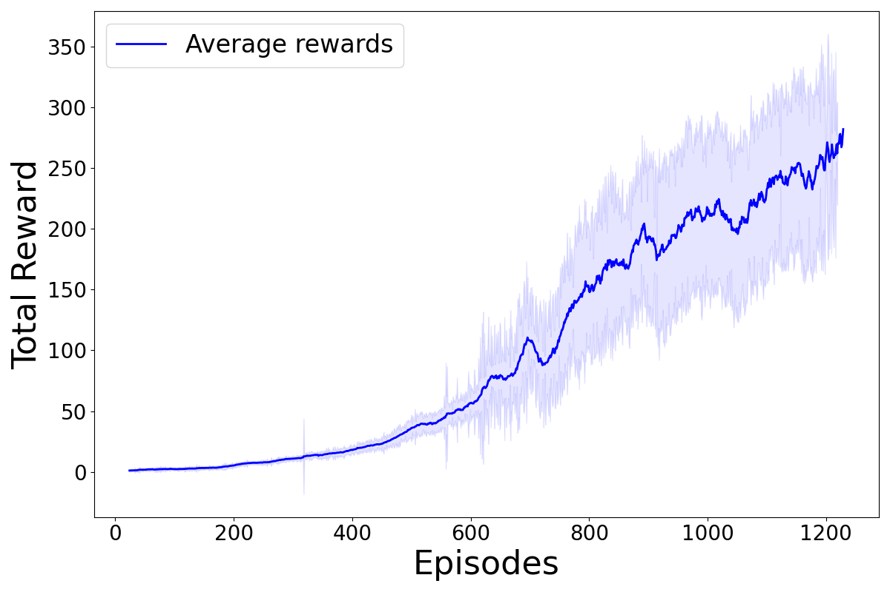
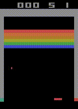
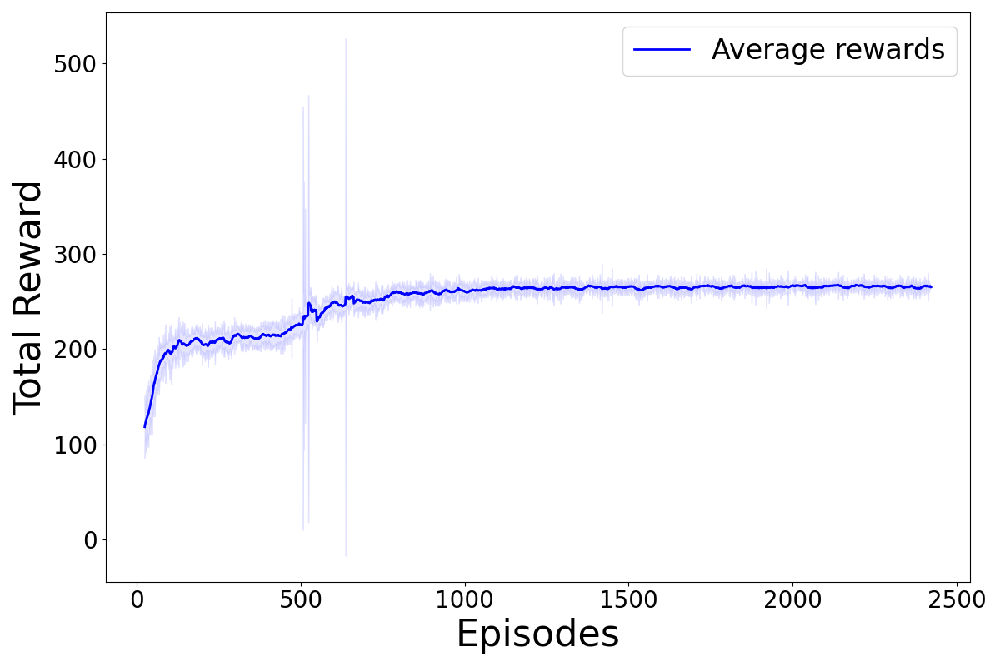
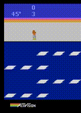
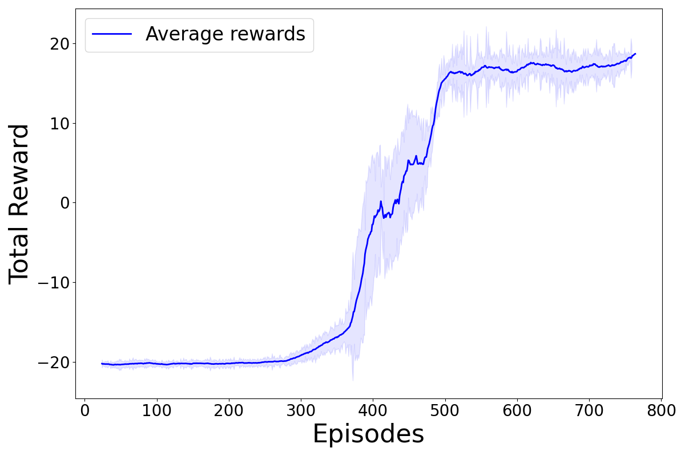
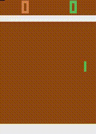
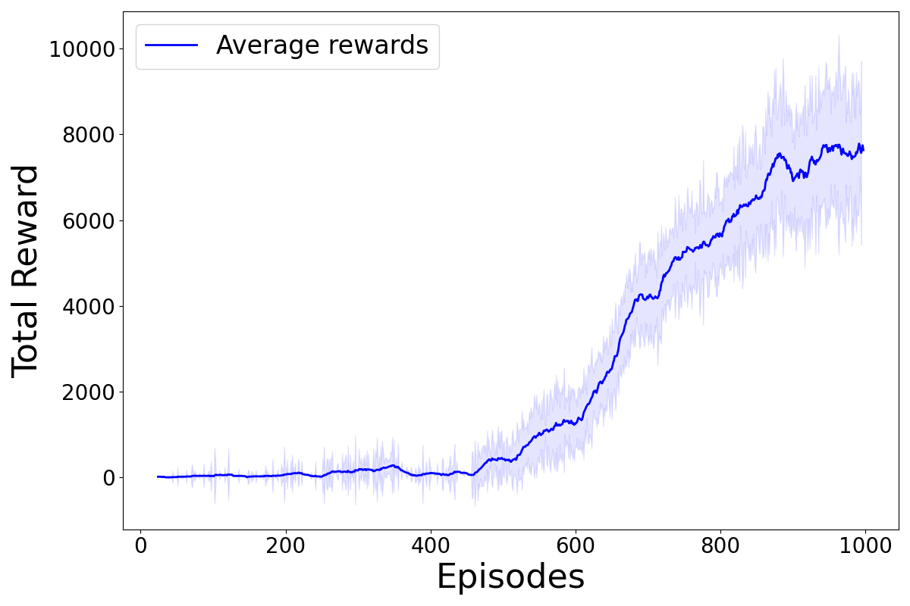
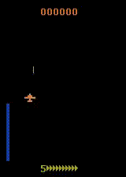

# A2C & PPO (PyTorch)

PyTorch implementation of **Advantage Actor-Critic (A2C)** and **Proximal Policy Optimization (PPO)** algorithms, supporting both tabular/continuous environments and Atari (convolutional networks).

## Installation

pip install -r requirements.txt

## Quick Usage

The repository provides `main.py` to train or evaluate the agents using a JSON configuration file:

python main.py --config path/to/config.json

If the `load_model` field is specified in the config, `main.py` runs in evaluation mode using the saved model. Otherwise, it runs in training mode.

## Expected `rollouts` format

The `update_agent` method expects a dictionary `rollouts` with the following keys:

- `states`: (T, N, obs_dim) or (T, N, C, H, W) for Atari  
- `actions`: (T, N)  
- `rewards`: (T, N)  
- `value_preds`: (T, N)  
- `masks`: (T, N)  
- `old_log_probs`: (T, N)  
- `entropies`: (T, N)

Where:
- T = number of steps per rollout  
- N = number of environments (`n_envs`)

## Example config.json

A JSON config file should include all hyperparameters for training or evaluation. Example:

```json
{
    "env_name": "ALE/Breakout-v5",
    "atari_mode": true,
    "seed": 123,
    "n_envs": 8,
    "n_updates": 1,
    "n_steps_per_update": 128,
    "gamma": 0.99,
    "lam": 0.95,
    "ent_coef": 0.01,
    "actor_lr": 0.00025,
    "critic_lr": 0.00025,
    "max_episode_steps": 1000,
    "ppo_epochs": 3,
    "ppo_batch_size": 256,
    "agent_type": "ppo",
    "frame_skip": 4,
    "stack_size": 4,
    "clip_coef": 0.1,
    "render_mode": null,
    "load_model": ""
}
```

All training hyperparameters (learning rates, discount factor, GAE lambda, number of actors, horizon, clipping, etc.) must be specified in this file.

## Mapping config fields to the agent

| Config field           | Where it is used in the agent           | Notes                                           |
| ---------------------- | --------------------------------------- | ----------------------------------------------- |
| env_name               | used externally in `train` / `evaluate` | Environment name (e.g., "ALE/Breakout-v5")      |
| atari_mode             | `A2CBase.__init__`                      | `True` activates CNN with `stack_size` channels |
| seed                   | external, sets random seeds             | Ensures reproducibility                         |
| n_envs                 | `A2CBase.__init__`                      | Number of parallel environments (N)             |
| n_updates              | external                                | Number of training updates                      |
| n_steps_per_update (T) | rollout horizon                         | Number of steps per update (128 in config)      |
| gamma                  | `hp["gamma"]`                           | Discount factor for future rewards (0.99)       |
| lam                    | `hp["lam"]`                             | GAE lambda (0.95)                               |
| ent_coef               | `hp["ent_coef"]`                        | Entropy coefficient for exploration (0.01)      |
| actor_lr               | `A2CBase.__init__`                      | Actor learning rate (0.00025)                   |
| critic_lr              | `A2CBase.__init__`                      | Critic learning rate (0.00025)                  |
| max_episode_steps      | external                                | Max steps per episode (1000)                    |
| ppo_epochs             | PPO only                                | Number of PPO epochs per update (3)             |
| ppo_batch_size         | PPO only                                | Minibatch size for PPO updates (256)            |
| clip_coef              | PPO only                                | PPO clipping coefficient (0.1)                  |
| agent_type             | `A2C` factory                           | `"a2c"` or `"ppo"`                              |
| stack_size             | `A2CBase.__init__` if `atari_mode=True` | Number of stacked frames (4)                    |
| frame_skip             | external, used in environment wrapper   | Frameskip in Atari environment (4)              |
| render_mode            | external                                | Rendering mode, e.g., `"human"` or `null`       |
| load_model             | external, triggers evaluation mode      | Path to saved model or empty string             |

## Plotting Rewards

The repository provides a script to generate moving-average reward plots with a visual "aura" representing variability.

### Usage

Run the plotter with:

python plot_rewards_moving_avg_aura_final.py path/to/rewards.csv [window_size] [--title "Plot Title"]

- `path/to/rewards.csv`: CSV file containing the reward history. The CSV must have at least two columns:  
  - `episode`: episode index  
  - `total_reward`: total reward obtained in that episode  
- `window_size` (optional): window size for moving average (default: 25)  
- `--title` (optional): plot title; if not specified, no title will be displayed  

### Example

```bash
python plot_rewards_moving_avg_aura_final.py data/breakout_rewards.csv 50 --title "Breakout PPO Rewards"
```

## Experiments: Atari ROMs

We replicated four experiments from the original PPO paper using the Atari environment. The experiments tested the following ROMs: **Breakout**, **Frostbite**, **Pong**, and **Zaxxon**.  

## Reward Plots and Agent Performance

**Breakout**  
  


**Frostbite**  
  


**Pong**  
  


**Zaxxon**  
  


### Average Rewards (Last 100 Episodes)

The table below shows the average total rewards over the last 100 episodes for our PPO replication:

| ROM        | PPO             |
|------------|-----------------|
| Breakout   | 268.9           |
| Frostbite  | 264.1           |
| Pong       | 18.5            |
| Zaxxon     | 7859.0          |
